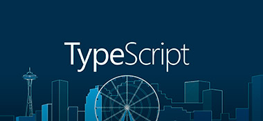

  

# Exercicios e desafios do curso Entendendo TypeScript(Cod3r)

### Tópicos abordados nessa repositório

* Estudo de Tipos
* Desafios
* Generics
* Interfaces
* Namespaces
* Modulos
* Decorators
* Classes
* Integração com React
* Integração com Gulp
* Integração com Webpack

---

Made whit ❤️  by <strong><a href="http://linkedin.com/in/cristian-silva-dev" target="blank" >Cristian</>
</strong>